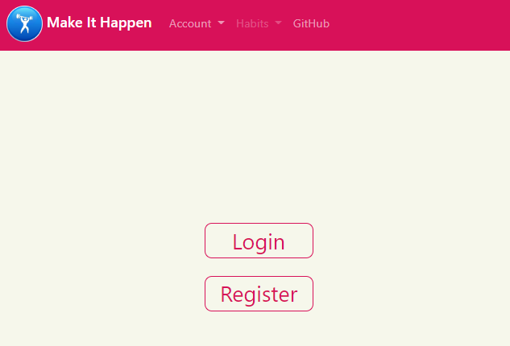
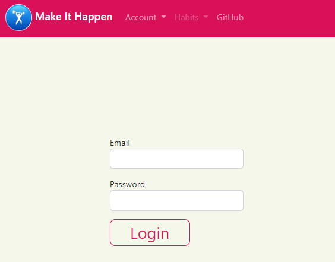
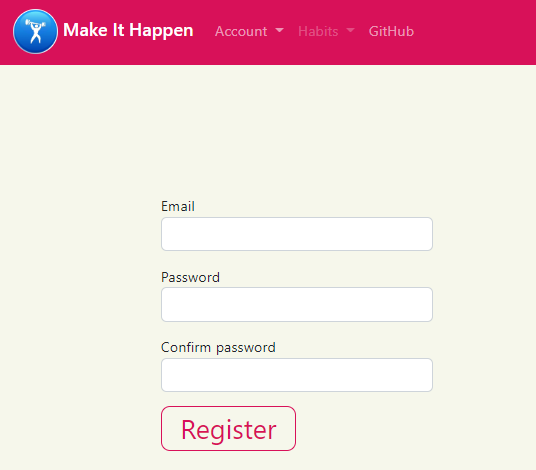
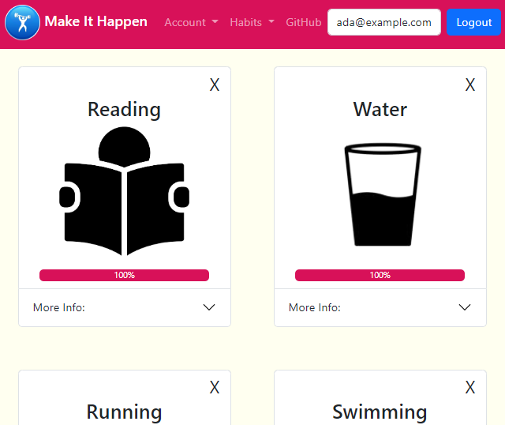
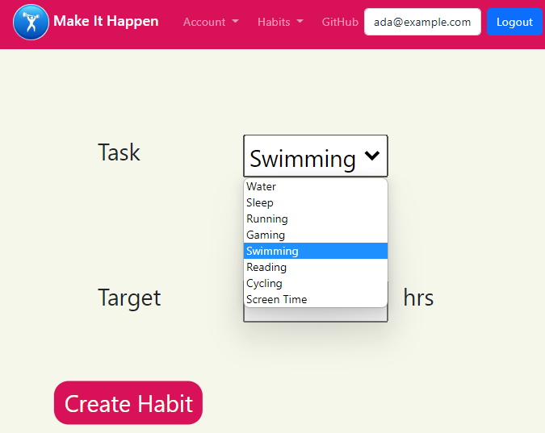
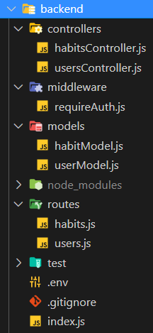
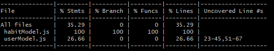
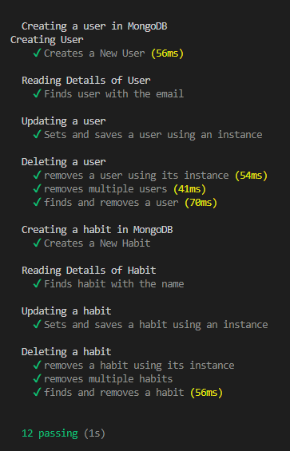

# Make It Happen

## Project Description
### The aim of the project was to build a habit tracker where users can:
* Register/login
* Choose a habit to track
* Track progress of habit completion
* Mark a habit as complete for the day

## Table of contents
1. [Installation](/README.md#installation)
2. [Technologies](/README.md#technologies)
3. [Website Preview](/README.md#website-preview)
4. [Process](/README.md#process)
5. [Wins & Challenges](/README.md#wins--challenges)
6. [Code Snippets](/README.md#code-snippets)
7. [Testing](/README.md#testing)
8. [Future Features](/README.md#future-features)
9. [License](/README.md#license)
10. [Contributors](/README.md#contributors)

## Installation and Usage

### *For the deployed website:*
The deployed website can be found on [netlify](https://make-it-happen-fp.netlify.app/).

### *For the deployed server:*
The deployed server can be found on [heroku](https://make-it-happen-fp.herokuapp.com/).

### *To run locally:*
* Clone or download the [repo](https://github.com/karldudley/makeithappen).
* Within the terminal, navigate to the backend folder.
* Run ```npm install``` to install all required dependencies.
* Run ```npm run dev``` to start the server.
* Within the client folder, from index.html, start a live server and the website should be running locally.

### *To run in docker:*

* From the root directory in a terminal, run ```bash -c "_scripts/startDev.sh```
* To end your session, run ```bash -c "_scripts/teardown.sh```


## Technologies
* Client - HTML / CSS (Bootstrap)
* Server - JavaScript / Node
* DB - MongoDB Atlas
### *Planning*
* [Trello](https://trello.com/b/ElQcWq6X/make-it-happen)
* Excalidraw
* Zoom/Slack
### *Dependecies*
* bcrypt
* dotenv
* express
* jsonwebtoken
* mongoose
* morgan
* nyc
* validator
* Jest
* Mocha
* Nodemon

## Website Preview
### *Homepage*


### *Login*


### *Register*


### *View Habits*


### *Create New Habit*


### *Common Nav Bar*


## Process
- We started by creating a mock-up of the client website layout using Excalidraw.
- We decided that the website would have the following pages: i) Home, ii) Login and iii) Register iv) View v) Create.
- With a rough overview complete, we discussed what tasks we would focus on. The main tasks we identified were:
  - Create a consistent look and feel for the website with a common navigation bar.
  - We decided to utilise bootstrap cards and our own custom styling to display the habits.
  - Building the backend to deal with CRUD requests for Habits and Users.
  - Implement auth/auth across the server and client.
- Tasks were kept track of on a kanban board using Trello.
- As soon as we had the foundations of a server and client by the end of the first day, we deployed to Netlify (client), Heroku (server) and MongoDB (data). This meant we were able to consistently view the changes we were making and test accordingly.
- We communicated regularly over Slack and Zoom to monitor our progress and help each other overcome issues. This included a daily standup.
- As we wrote the client code, we tested the html layout and javascript functions using Jest in node.js.
- As we wrote the server code, we tested the CRUD functionality using Mocha.
- After the bulk of the client website had been built, the next task was to integrate it with the server. At this point we began to work a lot more closely as a team to ensure client and server code worked together smoothly.
- With the main functionality (ability to create habits and view them) in place, we turned our attention to implementing auth/auth. This was implemented using middleware on the server that set a requirement for a JWT to access the habits endpoints.
- We did extensive user testing to identify bugs and made fixes.
- Some final adjustments were made to the styling and a few media queries were added to adjust the layout of the cards when the screen size changed.

## Wins & Challenges
### *Wins*
1. Implementing CRUD functionality on the server using MVC approach.
2. Implementing Auth/Auth across server and client.
3. Progress bar.
4. Testing is able to provide a coverage of over 60%.

### *Challenges*
1. Updating the streak data. There is a current streak value and a max streak value. To update these we had to compare the last streak update date to the current date. This was to ensure users weren't allowed to complete the same habit more than once per day. Towards the end of development I found out about MongoDB Atlas Triggers that would have made this challenge a lot easier to solve. I will make more use of these next time.
2. 

## Code Snippets
### *MVC Approach*


### *Require Auth - Middleware*
```
const jwt = require('jsonwebtoken')
const User = require("../models/userModel")

const requireAuth = async (req, res, next) => {
    //verify authentication
    const { authorization } = req.headers

    if (!authorization) {
        return res.status(401).json({error: "Authorization token required"})
    }

    const token = authorization.split(" ")[1]
    try {
        const {_id} = jwt.verify(token, process.env.SECRET)
        req.user = await User.findOne({_id}).select('_id')
        next()
    } catch (error) {
        console.log(error)
        res.status(401).json({error: "Request is not authorised"})
    }
}

module.exports = requireAuth
```
### *Update Habit - Controller*
```
// update a habit
const updateHabit = async (req, res) => {
    const { id } = req.params
  
    if (!mongoose.Types.ObjectId.isValid(id)) {
      return res.status(400).json({error: 'No such habit'})
    }

    //change depending on if the update relates to streak data
    if(req.body.currentStreak) {
        //update current streak as long as it hasn't already been updated today
        // when it was last updated
        let habitStreak = await Habit.findById({_id: id})
        let streakDate = habitStreak.streakDate;

        // today's date
        let today = new Date(req.body.streakDate)

        // check if they are the same day
        let isSameDay = (streakDate.getDate() === today.getDate() 
        && streakDate.getMonth() === today.getMonth()
        && streakDate.getFullYear() === today.getFullYear())

        // if not the same day update
        if (!isSameDay) {
            let habit = await Habit.findOneAndUpdate({_id: id}, {
                ...req.body
            })
            //update max streak
            console.log(req.body)
            console.log(req.body.currentStreak,habitStreak.maxStreak)

            
            if (req.body.currentStreak>habitStreak.maxStreak){
                let newMax = { maxStreak: req.body.currentStreak };
                habit = await Habit.findOneAndUpdate({_id: id}, newMax)
            }

            if (!habit) {
                return res.status(400).json({error: 'No such habit'})
            }
            
            res.status(200).json(habit)
        }
        
    }
    else {
        const habit = await Habit.findOneAndUpdate({_id: id}, {
            ...req.body
        })

        if (!habit) {
            return res.status(400).json({error: 'No such habit'})
        }
        
        res.status(200).json(habit)
    }
    
}
```
## Testing
#### We used Mocha to test the server because it had better functionality to test MongoDB
### *Mocha Coverage*


### *CRUD Testing*


## Future Features
- Ability to add new habits
- Ability  to link progress to habit completion i.e. when progress hits 100%, automatically mark the habit as complete

## License
## 

## Contributors

### [Ayo Soyannwo](https://github.com/Mounaiyk)
### [Duncan Cornish](https://github.com/duncancornish)
### [Jakerin Ahmed](https://github.com/jakerinahmed)
### [Karl Dudley](https://github.com/karldudley)
